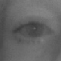
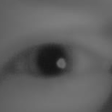

# open-closed-eye-0001

## Use Case and High-Level Description

Fully convolutional network for recognition of eye state ('open', 'closed').

## Example

## Specification

| Metric                          | Value                                     |
|---------------------------------|-------------------------------------------|
| Source framework                | PyTorch*                                  |
| GFlops                          | 0.001                                     |
| MParams                         | 0.01125                                   |
| Accuracy                        | 0.959                                     |

## Dataset

[MRL Eye Dataset](http://mrl.cs.vsb.cz/eyedataset) is used for training and validation (each 10th image is used for test). 

## Performance

## Inputs

1. name: "input.1" , shape: [1x3x32x32] - An input image in [1xCxHxW] format. Expected color order is BGR.

## Outputs

1. name: "19", shape: [1, 2, 1, 1] - Softmax output across 2 type classes [open, closed]

## Legal Information
[*] Other names and brands may be claimed as the property of others.
