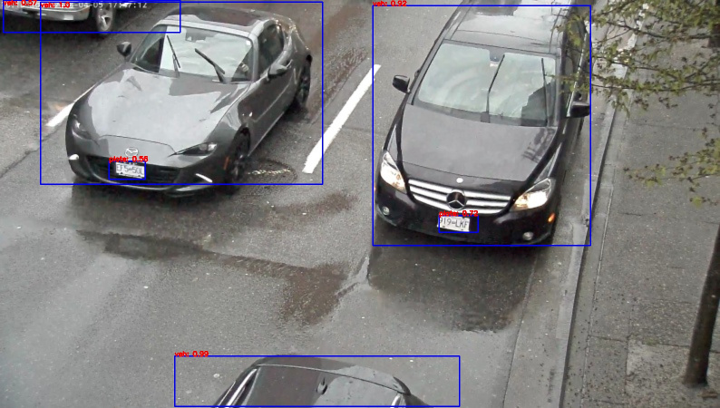

# vehicle-license-plate-detection-barrier-0123

## Use Case and High-level Description

This is a MobileNetV2 + SSD-based vehicle and (Chinese) license plate detector for
the "Barrier" use case.

## Example


## Specification

| Metric                          | Value                                      |
|---------------------------------|--------------------------------------------|
| Mean Average Precision (mAP)    | 99.52%                                     |
| AP vehicles                     | 99.90%                                     |
| AP plates                       | 99.13%                                     |
| Car pose                        | Front facing cars                          |
| Min plate width                 | 96 pixels                                  |
| Max objects to detect           | 200                                        |
| GFlops                          | 0.271                                      |
| MParams                         | 0.547                                      |
| Source framework                | TensorFlow*                                |

Average Precision (AP) is defined as an area under the
[precision/recall](https://en.wikipedia.org/wiki/Precision_and_recall)
curve. Validation dataset is BIT-Vehicle.

## Input

### Original Model

An input image, name: `input`, shape: `1, 256, 256, 3`, format: `B, H, W, C`, where:

- `B` - batch size
- `H` - image height
- `W` - image width
- `C` - number of channels

Expected color order: `RGB`.
Mean values: [127.5, 127.5, 127.5], scale factor for each channel: 127.5

### Converted Model

An input image, name: `input`, shape: `1, 3, 256, 256`, format `B, C, H, W`, where:

- `B` - batch size
- `C` - number of channels
- `H` - image height
- `W` - image width

Expected color order is `BGR`.

## Output

### Original Model

The net outputs a blob with the shape: `1, 1, 200, 7` in the format `1, 1, N, 7`, where `N` is the number of detected
bounding boxes. For each detection, the description has the format:
[`image_id`, `label`, `conf`, `x_min`, `y_min`, `x_max`, `y_max`], where:

- `image_id` - ID of the image in the batch
- `label` - predicted class ID
- `conf` - confidence for the predicted class
- (`x_min`, `y_min`) - coordinates of the top left bounding box corner
- (`x_max`, `y_max`) - coordinates of the bottom right bounding box corner.

### Converted Model

The net outputs a blob with the shape: `1, 1, 200, 7` in the format `1, 1, N, 7`, where `N` is the number of detected
bounding boxes. For each detection, the description has the format:
[`image_id`, `label`, `conf`, `x_min`, `y_min`, `x_max`, `y_max`], where:

- `image_id` - ID of the image in the batch
- `label` - predicted class ID
- `conf` - confidence for the predicted class
- (`x_min`, `y_min`) - coordinates of the top left bounding box corner
- (`x_max`, `y_max`) - coordinates of the bottom right bounding box corner.

## Download a Model and Convert it into Inference Engine Format

You can download models and if necessary convert them into Inference Engine format using the [Model Downloader and other automation tools](../../../tools/downloader/README.md) as shown in the examples below.

An example of using the Model Downloader:
```
python3 <omz_dir>/tools/downloader/downloader.py --name <model_name>
```

An example of using the Model Converter:
```
python3 <omz_dir>/tools/downloader/converter.py --name <model_name>
```

## Legal Information
The original model is distributed under the
[Apache License, Version 2.0](https://raw.githubusercontent.com/opencv/openvino_training_extensions/develop/LICENSE).
A copy of the license is provided in [APACHE-2.0.txt](../licenses/APACHE-2.0.txt).

[*] Other names and brands may be claimed as the property of others.
